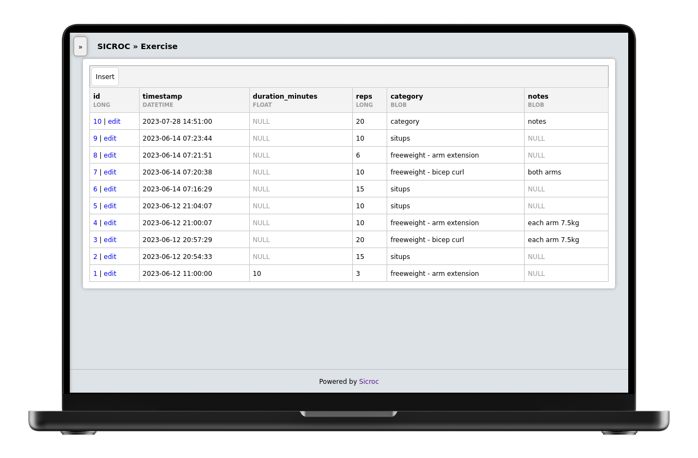

<div align = "center">
  
  <h1>Sicroc</h1>

 Extend a real database to build your own webapps safely.

[](https://github.com/jamesread/Sicroc/actions/workflows/build-tag.yml) [](https://discord.gg/jhYWWpNJ3v)

</div>

If you are "old": Think about the usefulness Microsoft Access, but on the web, with a real database and no visual basic.

If you're "less old": Think of a Google Spreadsheet, but with with user permissions and no broken sheets with weird formulas.

## Screenshots



## Use casess

- **Simple lists**: Keep track of your books, movies, games, etc.
- **Calendaring**: keep track of your appointments, events, etc with multiple users and permissions.
- **Simple CRM**: Keep track of your customers, suppliers, etc.

## Installation

```shell
docker create --name sicroc -p 8080:8080 ghcr.io/jamesread/sicroc
docker start sicroc
```

## Technical Overview

### **Sicroc has the following design goals;**

- **Zero lock-in**: It should be easy and safe to delete or migrate away from Sicroc at any time, and leave your data intact (and still very usable). 
- **Self-hackable**: easy to change layouts and functionality as you see fit.
- **Super cheap to host/run**: Any LAMP server with 512mb of RAM and a MySQL database will work.- millions of hosters can run Sicroc for $3/month.
- **Very low effort to maintain**: No Kubernetes, docker, services, python libraries or setup is needed. All database changes are migratable. 
- **Very low dependencies**: Sicroc only really uses libAllure (which is mostly a shim on core PHP features), and a library for OpenID connect. 


### **Sicroc gets out of the way of your data;**

- Your data is stored in plain old MySQL tables.
- All Sicroc metadata is stored in a self contained database, meaning your data and tables are clean and safe if you move away from Sicroc. 
- Sicroc doesn't stop you using real data types and real foreign keys, etc. you can bring it to existing databases and it will just work. 

### **Sicroc is a No-Nonsense Open Source project;**

- All code and assets are Open Source (AGPL).
- No company is paying for development, there is no paid-for support from the developers.
- No separate core and premium version, no plus/pro version or paid-for extra features.
- No SaaS service or "special cloud version".
- No "anonymous data collection", usage tracking, user tracking, telemetry or email address collection.
- No requests for reviews in any "app store" or feedback surveys.
- No prompts to "upgrade to the latest version".
- No internet-connection required for any functionality.

