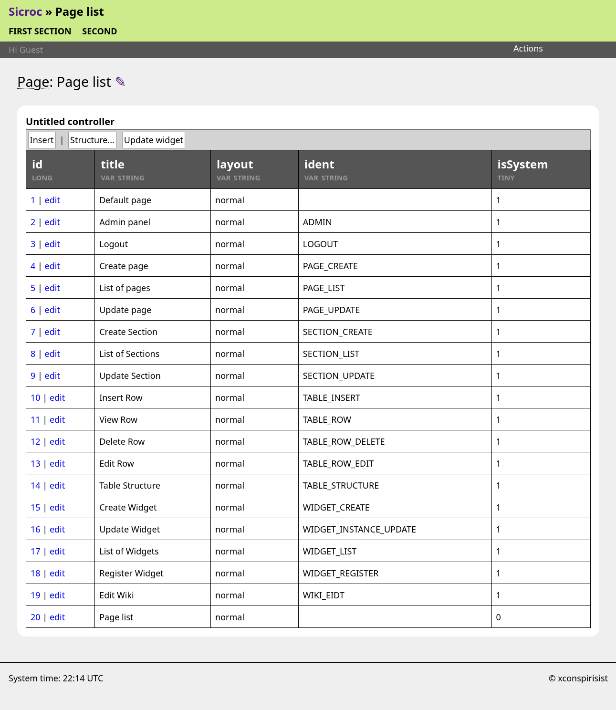

Sicroc
===

Build CRUD (Create, Read, Update and Delete) apps around the MySQL Database.

Packagist.org link: https://packagist.org/packages/jamesread/sicroc

**Sicroc is a No-Nonsense Open Source project;**

- All code and assets are Open Spurce (AGPL). 
- No premium, or paid-for extra features. 
- No SaaS service or "special cloud version". 
- No user tracking, telemetry or email address collection. 
- No paid-for support.

**Sicroc gets out of the way of your data;** 

- Your data is stored in plain old MySQL tables.
- All Sicroc metadata is stored in a self contained database, meaning your data and tables are clean and safe if you move away from Sicroc. 
- Sicroc doesn't stop you using real data types and real foreign keys, etc. you can bring it to existing databases and it will just work. 

**Sicroc has the following design goals;**

- **Zero lock-in**: It should be easy and safe to delete or migrate away from Sicroc at any time, and leave your data intact (and still very usable). 
- **Self-hackable**: easy to change layouts and functionality as you see fit.
- **Super cheap to host/run**: Any LAMP server with 512mb of RAM and a MySQL database will work.- millions of hosters can run Sicroc for $3/month.
- **Very low effort to maintain**: No Kubernetes, docker, services, python libraries or setup is needed. All database changes are migratable. 
- **Very low dependencies**: Sicroc only really uses libAllure (which is mostly a shim on core PHP features), and a library for OpenID connect. 
